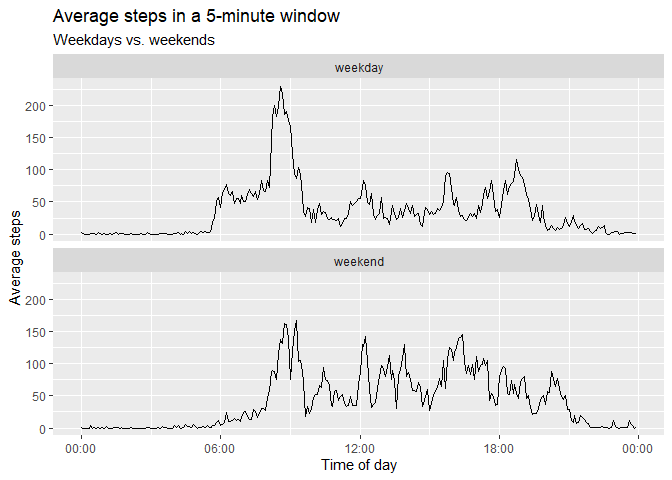

## Loading and preprocessing the data


```r
convert_interval <- function(x) {
  padded_x <- str_pad(x, width = 4, side = "left", pad = "0")
  
  paste(str_sub(padded_x, 1, 2), str_sub(padded_x, 3, 4), "00", sep = ":") %>% 
    chron::times()
}

steps <- read_csv("activity.zip") %>% 
  mutate(interval2 = convert_interval(interval)) 
```

```
## Parsed with column specification:
## cols(
##   steps = col_double(),
##   date = col_date(format = ""),
##   interval = col_double()
## )
```


## What is mean total number of steps taken per day?


```r
steps_by_day <- steps %>% 
  group_by(date) %>% 
  summarise(daily_steps = sum(steps, na.rm = TRUE))

steps_by_day %>% ggplot(aes(daily_steps)) + geom_histogram(binwidth = 2000)
```

<!-- -->

```r
mean_daily_steps <- mean(steps_by_day$daily_steps) %>% round()
median_daily_steps <- median(steps_by_day$daily_steps) %>% format(scientific = FALSE)
```

The mean total number steps taken per day is **9354**.

The median total number steps taken per day is **10395**.


## What is the average daily activity pattern?


```r
steps_interval <- steps %>% 
  group_by(interval2) %>% 
  summarise(steps_avg = mean(steps, na.rm = TRUE))

steps_interval %>% 
  ggplot(aes(interval2, steps_avg)) + 
  geom_line() + 
  scale_x_chron(format = "%H:%M") + 
  labs(title = "Average steps in a 5-minute window",
       x = "Time of day",
       y = "Average steps")
```

<!-- -->

```r
time_max_steps <- steps_interval$interval2[which.max(steps_interval$steps_avg)] %>% as.character()
```

The 5-minute interval at **08:35:00** contains the maximum number of steps.

## Imputing missing values

The strategy that I have chosen to impute missing data is to replace the missing values with the average value of the same interval of all days.


```r
n_missing <- sum(!complete.cases(steps))

steps_imputed <- steps %>% 
  left_join(steps_interval, by = "interval2") %>% 
  mutate(steps = ifelse(is.na(steps), steps_avg, steps)) %>% 
  select(-steps_avg)

steps_by_day_imp <- steps_imputed %>% 
  group_by(date) %>% 
  summarise(daily_steps = sum(steps, na.rm = TRUE))

steps_by_day_imp %>% ggplot(aes(daily_steps)) + geom_histogram(binwidth = 2000)
```

<!-- -->

```r
mean_daily_steps_imp <- mean(steps_by_day_imp$daily_steps) %>% round() %>% format(scientific = FALSE)
median_daily_steps_imp <- median(steps_by_day_imp$daily_steps) %>% round() %>% format(scientific = FALSE)
```
The number of missing values is **2304**.


When missing data are imputed with the average for the concerning time interval, the mean total number steps taken per day is **10766**.

When missing data are imputed with the average for the concerning time interval, the median total number steps taken per day is **10766**.

## Are there differences in activity patterns between weekdays and weekends?


```r
steps_interval_wk <-  steps_imputed %>% 
  mutate(part_of_week = as.factor(ifelse(wday(date) %in% c(1,7), "weekend", "weekday" ))) %>% 
  group_by(part_of_week, interval2) %>% 
  summarise(steps_avg = mean(steps))

steps_interval_wk %>% 
  ggplot(aes(interval2, steps_avg)) + 
  geom_line() + 
  scale_x_chron(format = "%H:%M") + 
  labs(title = "Average steps in a 5-minute window",
       subtitle = "Weekdays vs. weekends",
       x = "Time of day",
       y = "Average steps") +
  facet_wrap(~part_of_week, ncol = 1)
```

<!-- -->

